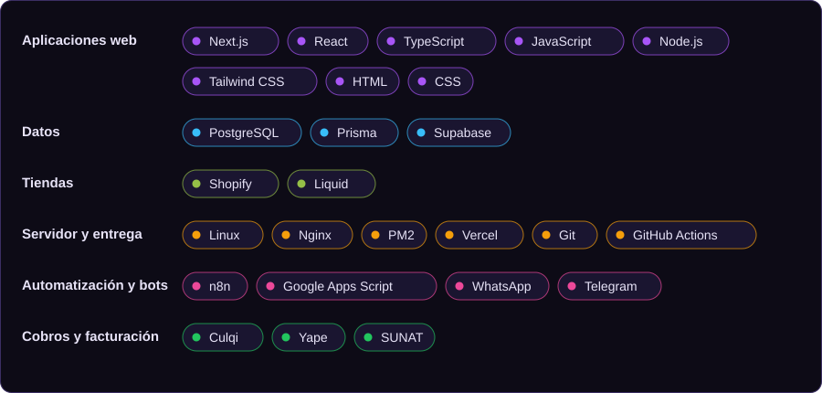
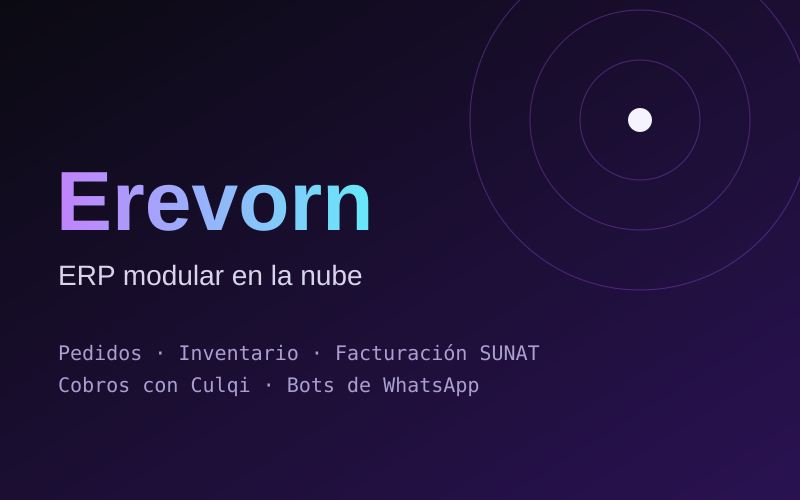
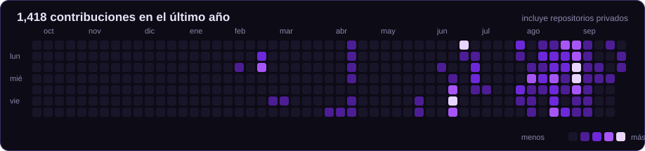

<picture>
  <source media="(prefers-color-scheme: dark)" srcset="assets/banner-dark.svg">
  <source media="(prefers-color-scheme: light)" srcset="assets/banner-light.svg">
  
</picture>

 

---

## `$ whoami`

  

---

## `$ cat stack.yaml`

Solo lo que uso de verdad, ordenado por para qué sirve.

  <picture>
    <source media="(prefers-color-scheme: dark)" srcset="assets/stack-dark.svg">
    <source media="(prefers-color-scheme: light)" srcset="assets/stack-light.svg">
    
  </picture>

---

## `$ ls proyectos/`

> Los repositorios de clientes son **privados**. Cada proyecto tiene su ficha en el portafolio, con capturas y, cuando se puede, una **demo para probar en vivo**.

<table>
  <tr>
    <td width="33%" valign="top" align="center">
       
      <b>Erevorn</b> 
      ERP modular en la nube: pedidos, inventario, facturación SUNAT, cobros y bots 
      <a href="https://erevorn.com">Ir a erevorn.com</a>
    </td>
    <td width="33%" valign="top" align="center">
       
      <b>Selecto Barber Studio</b> 
      Reservas y tienda para una barbería de Lima, con panel del dueño 
      <a href="https://work.erevorn.com/selecto-barber-studio">Ver ficha y demo</a>
    </td>
    <td width="33%" valign="top" align="center">
       
      <b>Toast Agency</b> 
      Tienda Shopify con portafolio en vídeo y productos digitales 
      <a href="https://work.erevorn.com/toast-agency">Ver ficha y demo</a>
    </td>
  </tr>
  <tr>
    <td width="33%" valign="top" align="center">
       
      <b>Soaki Swim</b> 
      Tienda Shopify con preventa por variante y colecciones automáticas 
      <a href="https://work.erevorn.com/soaki-swim">Ver ficha y demo</a>
    </td>
    <td width="33%" valign="top" align="center">
       
      <b>Tienda de intimidad</b> 
      Tienda Shopify con verificación de edad y cobro por Yape 
      <a href="https://work.erevorn.com/tienda-de-intimidad">Ver ficha y demo</a>
    </td>
    <td width="33%" valign="top" align="center">
       
      <b>Florelima Atelier</b> 
      Sistema de pedidos: formulario, hoja de cálculo y tablero 
      <a href="https://work.erevorn.com/florelima-atelier">Ver ficha y demo</a>
    </td>
  </tr>
</table>

---

## `$ git log --since="1 year"`

  <picture>
    <source media="(prefers-color-scheme: dark)" srcset="assets/actividad-dark.svg">
    <source media="(prefers-color-scheme: light)" srcset="assets/actividad-light.svg">
    
  </picture>

---

  ¿Tienes un negocio y una idea? <a href="https://work.erevorn.com">Mira el portafolio</a> y escríbeme. · Hecho en Lima, Perú.

